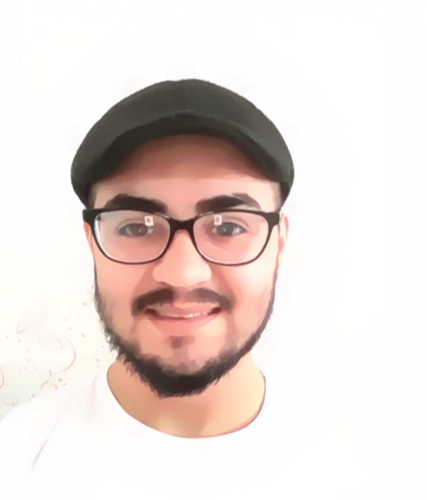

<h2 style="color: #666;margin:0em;"> Merhaba! I am Mehmet, Nice to meet you. </h2>

 

I am Co-founder & Software Developer at [Gnarly Game Studio](https://www.linkedin.com/company/gnarlygamestudio).

🔭 I’m currently working on **building multiplayer casual games**.
🌱 I’m currently learning **game design and the psychological basis of gaming**.
🤔 I would be happy to talk about **company culture and game design ideas**.
💬 Ask me about **data analysis, DevOps, LiveOps, back-end, casual game development**.
📫 How to reach me: [linkedin.com/in/mgurdal](https://www.linkedin.com/in/mgurdal/)

 

