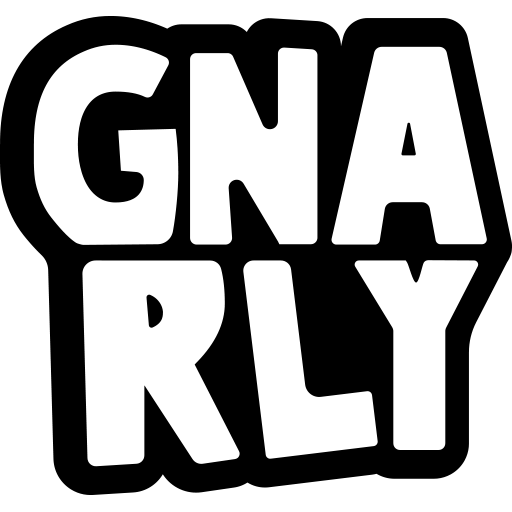
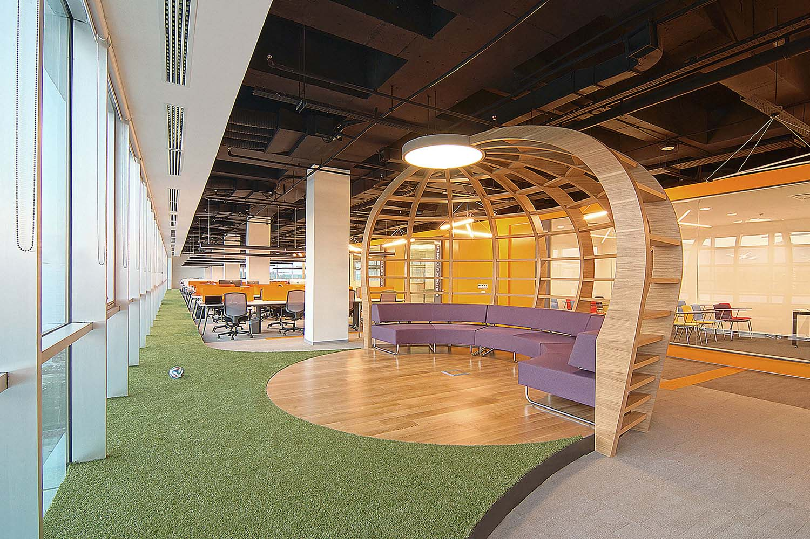
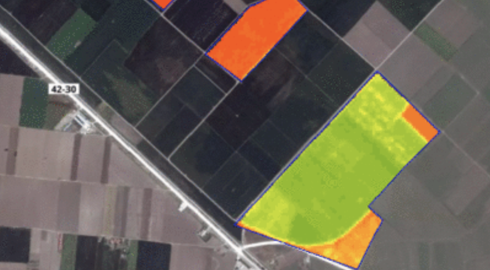

## Gnarly Game Studio
<small><b> 03/2020</b></small>

Gnarly is focused on building social based online mobile games with mass-market appeal.
We want our games to be a good companion for people when they want to get away from the stress of everyday life.

## Metglobal
<small><b> 08/2019 03/2020</b></small>

Metglobal houses a variety of brands in their portfolio established in online travel and travel-related technologies allowing partners to operate in over many countries and territories across the globe.
My team was responsible for providing online tours, car rentals, and private transfers by developing RESTFul web applications.

## tarla.io
<small><b> 07/2017 08/2019</b></small>

[tarla.io](tarla.io) provides information services to solve problems of the farmers and the sector.

I developed the back-end part of a platform for individual and corporate customers.
Our platform digitalized field expert's works by collecting and analyzing data from unbiased 
data sources.
